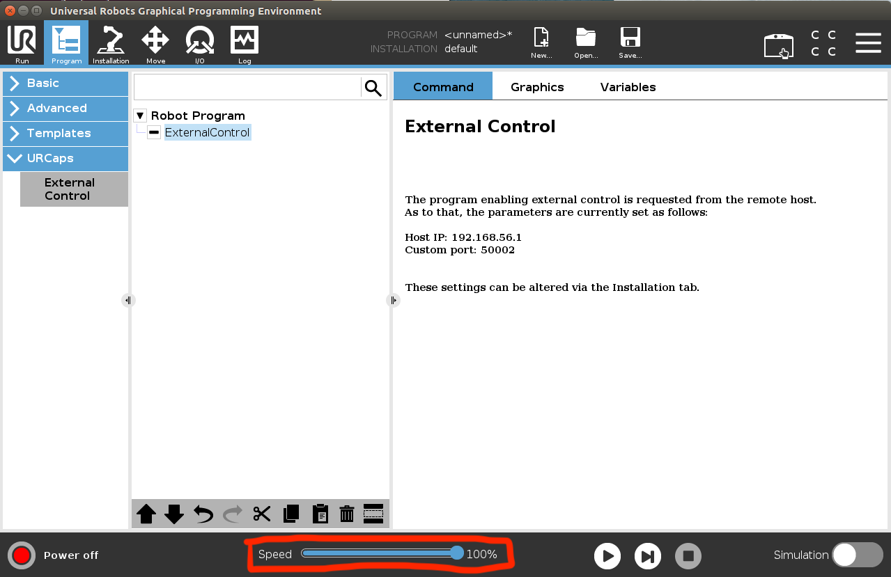

# TeachBot UR

## Before Starting

This guide assumes that you have set up TeachBot according to the README at the root of the TeachBot repository (including all of the browser permissions). These instructions are based off of the UR5e. 

## Installing the Universal Robots ROS Driver
Installation instructions are adapted from the official Universal Robots ROS Driver repo: https://github.com/UniversalRobots/Universal_Robots_ROS_Driver

Inside `~/TeachBot/robot/src` run the following commands. 
```bash
# clone the driver
$ git clone https://github.com/UniversalRobots/Universal_Robots_ROS_Driver.git src/Universal_Robots_ROS_Driver

# clone fork of the description to use the calibration feature
$ git clone -b calibration_devel https://github.com/fmauch/universal_robot.git src/fmauch_universal_robot

# install dependencies
$ sudo apt update -qq
$ rosdep update
$ rosdep install --from-path src --ignore-src -y

# build the workspace
$ cd ../
$ catkin_make

# activate the workspace (ie: source it)
$ source devel/setup.bash
```

## Setting up a UR robot for the ur_robot_driver
To set up a UR robot for the ur_robot_driver, follow the instructions provided from the <a href="https://github.com/UniversalRobots/Universal_Robots_ROS_Driver/blob/master/README.md#prepare-the-robot">Prepare the robot section</a> and <a href="https://github.com/UniversalRobots/Universal_Robots_ROS_Driver/blob/master/README.md#prepare-the-ros-pc">Prepare the ROS PC</a>. In this repository, the calibration file was placed inside `$(HOME/TeachBot/robot/src/ur)`, but it can be placed anywhere as long as you use the correct path when passing it into commands as a parameter. 

Note that setting up an e-series robot has additional instructions. 

## Running Teachbot
First, make sure your UR robot is on, and that the external cap has been set to connect to your PC (<a href="https://github.com/UniversalRobots/Universal_Robots_ROS_Driver/blob/master/ur_robot_driver/doc/install_urcap_e_series.md"> e-series instructions</a>). Do not press play yet for the robot program. 

You can adjust the speed that your robot moves at using the speed slider. It is outlined in red below. 

 

On your PC, open three terminals to `~/TeachBot/robot` and don't forget to `source devel/setup.bash`. 

In the first terminal, run the following command with your parameters:

    $ roslaunch ur_robot_driver ur5e_bringup.launch robot_ip:=169.254.157.0 \ kinematics_config:="$(HOME/TeachBot/robot/src/ur/ur5e_robot_calibration.yaml)

For `robot_ip:=`, put the IP address of your UR robot to replace the IP address of this example. 

For `kinematics_config:=`, put the path to your configuration file and replace the example. 

Once this command has run successfully, press "play" on the UR5e interface. It is to the right of the speed slider. If the connection is successful, you should see a confirmation in your terminal tab and no errors on the UR5e interface. 

```bash
[ INFO] [1573668956.316314604]: Robot requested program
[ INFO] [1573668956.316407273]: Sent program to robot
[ INFO] [1573668957.972437669]: Robot ready to receive control commands.
```

In the next terminal tab, run 

    $ rosrun ur teachbot.py

Then, navigate to the last tab and run

    $ roslaunch ../browser/websocket.launch & node ../browser/www.js &

And navigate to https://localhost:8000 to begin Module 1. 


